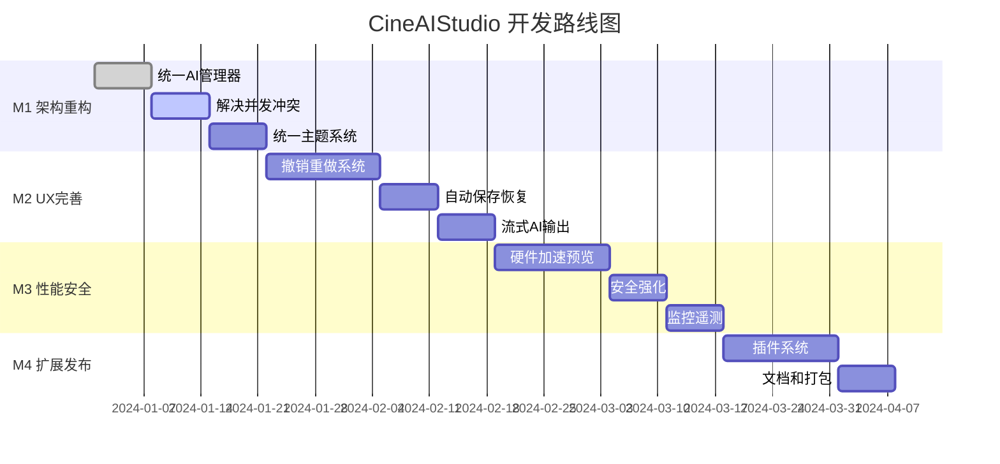

# CineAIStudio 项目需求文档 (PRD) - 技术架构分析与实施路线图

## 1. 项目概况

### 1.1 项目简介
CineAIStudio 是一款基于 Python PyQt6 开发的 AI 驱动短剧视频编辑应用，专为短剧创作者设计。集成多种 AI 大模型，实现智能解说生成、高能混剪、第一人称独白等功能，并与剪映深度集成。

### 1.2 当前版本状态
- **版本**: v0.2.1 (生产就绪候选)
- **技术栈**: Python 3.9+, PyQt6, OpenCV, FFmpeg, 多AI模型
- **架构模式**: MVC/MVVM, 信号驱动, 模块化设计
- **代码质量**: 中等，存在技术债务需要重构

## 2. 技术架构评估

### 2.1 架构质量分析

#### 优势
- ✅ 清晰的应用入口点和生命周期管理
- ✅ 模块化管理器设计 (ProjectManager, AIManager, SettingsManager)
- ✅ 基于 PyQt6 信号的事件驱动架构
- ✅ 分层的 UI 组件系统
- ✅ 错误处理和性能监控机制

#### 关键问题
- ❌ **双重 AI 管理器冲突**: AIManager vs EnhancedAIManager
- ❌ **混合并发模型**: Qt 信号 + asyncio.run() 在线程中
- ❌ **重复主题系统**: 3个独立的主题管理实现
- ❌ **部分模块未完全集成**: 存在占位符和模拟数据

#### 技术债务评估
- **高优先级**: 统一 AI 管理架构
- **高优先级**: 解决异步/线程安全问题
- **中优先级**: 合并重复的主题系统
- **中优先级**: 完善 UI 与后端的数据绑定

### 2.2 代码组织和模块化

#### 目录结构分析
```
app/
├── ai/                  # AI功能模块 (较完整)
├── core/                # 核心业务逻辑 (需完善)
├── ui/                  # 用户界面组件 (结构良好)
├── config/              # 配置管理 (基本完整)
├── utils/               # 工具函数 (需扩展)
├── integrations/        # 第三方集成 (剪映)
├── export/              # 导出功能
└── effects/             # 特效引擎
```

#### 模块完整性评估
- **AI模块**: 85% 完整，支持6大提供商
- **核心模块**: 70% 完整，缺少关键业务逻辑
- **UI模块**: 80% 完整，需要数据绑定
- **配置模块**: 90% 完整，安全性需加强

### 2.3 AI 集成完整性

#### 支持的 AI 提供商
1. **OpenAI**: GPT-3.5, GPT-4
2. **通义千问**: Qwen系列模型
3. **文心一言**: ERNIE系列
4. **智谱AI**: GLM系列
5. **讯飞星火**: Spark系列
6. **DeepSeek**: 代码和对话模型
7. **Ollama**: 本地大模型支持

#### AI 功能矩阵
| 功能 | 实现状态 | 完整度 | 备注 |
|------|----------|--------|---------|
| 智能解说生成 | ✅ 已实现 | 85% | 支持多种风格 |
| 高能混剪检测 | ✅ 已实现 | 75% | 场景分析算法需优化 |
| AI字幕生成 | ✅ 已实现 | 80% | 支持多语言 |
| 语音合成(TTS) | ✅ 已实现 | 70% | 情感化语音待完善 |
| 内容分析 | ⚠️ 部分实现 | 60% | 分析深度有限 |
| 脚本生成 | ⚠️ 部分实现 | 65% | 模板需丰富 |
| 智能负载均衡 | ✅ 已实现 | 90% | 支持多种策略 |
| 成本管理 | ✅ 已实现 | 85% | 预算控制完善 |

### 2.4 UI/UX 系统成熟度

#### 设计系统组件
- **ProfessionalCard**: 专业卡片组件 ✅
- **ProfessionalButton**: 多样式按钮系统 ✅
- **ProfessionalNavigation**: 垂直导航栏 ✅
- **UnifiedThemeManager**: 统一主题管理 ⚠️
- **ResponsiveLayout**: 响应式布局引擎 ✅
- **AccessibilitySystem**: 无障碍支持 ✅

#### UI 完整性评估
- **导航系统**: 95% 完整
- **主题系统**: 60% 完整 (需统一)
- **响应式设计**: 80% 完整
- **组件库**: 85% 完整
- **交互体验**: 75% 完整

## 3. 功能完备性分析

### 3.1 核心功能状态

#### 项目管理
- ✅ 项目创建、打开、保存
- ✅ 项目模板系统
- ⚠️ 版本控制 (部分实现)
- ⚠️ 备份恢复 (基础实现)
- ❌ 协作功能 (未实现)

#### 视频编辑
- ✅ 基础时间轴编辑器
- ✅ 视频预览系统
- ⚠️ 多轨道支持 (基础实现)
- ⚠️ 特效引擎 (部分实现)
- ❌ 高级调色 (未完整实现)

#### 导出功能
- ✅ 多格式导出支持
- ✅ 剪映集成导出
- ⚠️ 批量导出 (基础实现)
- ❌ 云端渲染 (未实现)

### 3.2 关键功能缺口

1. **实时协作**: 多用户同时编辑项目
2. **高级特效**: GPU加速的特效渲染
3. **智能推荐**: 基于用户行为的内容推荐
4. **云端同步**: 项目和素材的云端存储
5. **插件系统**: 第三方扩展支持

## 4. 性能和安全考量

### 4.1 性能优化状态
- ✅ 智能内存管理系统
- ✅ 多线程任务处理
- ✅ GPU硬件加速支持
- ⚠️ 视频预览优化 (需统一管道)
- ❌ 大型项目处理 (内存压力)

### 4.2 安全风险评估
- **高风险**: API密钥明文存储
- **中风险**: 文件路径验证不足
- **中风险**: 依赖项安全审计缺失
- **低风险**: 用户输入验证

## 5. 开发优先级矩阵

### 5.1 P0 级别 (稳定性/一致性)

#### 架构统一 (2-3周)
1. **统一AI管理器**
   - 迁移所有功能到 EnhancedAIManager
   - 移除旧的 AIManager 实现
   - 标准化 AI 接口调用

2. **解决并发模型冲突**
   - 消除 asyncio.run() 在 Qt 线程中的使用
   - 实现统一的 QThread + 异步任务队列
   - 建立线程安全的信号桥接

3. **统一主题系统**
   - 采用 UnifiedThemeManager 作为唯一主题管理器
   - 移除 professional_ui_system 和 theme_manager 的重复实现
   - 生成统一的设计令牌

4. **数据绑定完善**
   - 连接 ProjectsPage 到 ProjectManager
   - 移除模拟数据，实现真实的 CRUD 操作
   - 建立响应式数据流

### 5.2 P1 级别 (核心UX和韧性)

#### 用户体验完善 (3-4周)
1. **撤销/重做系统**
   - 实现基于命令模式的操作历史
   - 支持细粒度的操作回滚
   - 内存优化的历史记录管理

2. **自动保存和崩溃恢复**
   - 实时自动保存机制
   - 崩溃后的项目恢复流程
   - 版本冲突解决机制

3. **流式AI输出**
   - 实现AI生成内容的实时流式显示
   - 支持生成过程的取消和暂停
   - 用户友好的进度指示

4. **导出管道完善**
   - 完整的格式验证和媒体探测
   - 预设模板和自定义导出配置
   - 后台渲染和进度跟踪

### 5.3 P2 级别 (扩展性/运维)

#### 系统扩展 (3-4周)
1. **插件系统**
   - 基于 entry_points 的 AI 提供商插件
   - 导出格式扩展插件
   - 特效和滤镜插件框架

2. **性能和安全强化**
   - 硬件加速的视频预览管道
   - 操作系统密钥环集成
   - 依赖项安全审计和SBOM

3. **监控和遥测**
   - 性能指标收集和分析
   - 用户行为分析
   - 错误追踪和崩溃报告

## 6. 技术实施路线图

### 6.1 里程碑时间线



### 6.2 关键技术决策

#### 并发模型重构
```python
# 当前问题模式
asyncio.run(ai_task())  # 在Qt线程中，导致嵌套事件循环

# 推荐解决方案
class AITaskManager(QObject):
    def __init__(self):
        self.thread_pool = QThreadPool()
        self.event_loop = None  # 单独的事件循环
    
    def execute_ai_task(self, task):
        worker = AIWorker(task)
        worker.finished.connect(self.on_task_finished)
        self.thread_pool.start(worker)
```

#### 依赖注入容器
```python
class ServiceContainer:
    def __init__(self):
        self._services = {}
        self._factories = {}
    
    def register(self, interface, implementation):
        self._services[interface] = implementation
    
    def get(self, interface):
        return self._services.get(interface)

# 使用方式
container = ServiceContainer()
container.register(IAIManager, EnhancedAIManager)
container.register(IProjectManager, ProjectManager)
```

#### 统一主题架构
```python
class DesignTokens:
    PRIMARY_COLOR = "#007acc"
    SURFACE_COLOR_DARK = "#2d2d2d"
    SURFACE_COLOR_LIGHT = "#ffffff"
    
class ThemeProvider:
    def __init__(self):
        self.current_theme = ThemeType.LIGHT
        self.tokens = DesignTokens()
    
    def apply_theme(self, theme_type):
        # 生成并应用QSS样式
        pass
```

### 6.3 质量保证措施

#### 测试策略
1. **单元测试**: 覆盖所有管理器和核心业务逻辑
2. **集成测试**: AI提供商接口和视频处理管道
3. **UI测试**: 关键用户流程的自动化测试
4. **性能测试**: 大型项目和长时间运行的压力测试

#### 代码质量工具
```yaml
# .pre-commit-config.yaml
repos:
  - repo: https://github.com/psf/black
    rev: 23.1.0
    hooks:
      - id: black
  - repo: https://github.com/pycqa/isort
    rev: 5.12.0
    hooks:
      - id: isort
  - repo: https://github.com/pycqa/flake8
    rev: 6.0.0
    hooks:
      - id: flake8
  - repo: https://github.com/pre-commit/mirrors-mypy
    rev: v1.0.0
    hooks:
      - id: mypy
```

## 7. 风险评估和缓解策略

### 7.1 技术风险

| 风险 | 概率 | 影响 | 缓解策略 |
|------|------|------|----------|
| Qt/异步集成复杂性 | 高 | 高 | 采用成熟的QThread模式，避免嵌套事件循环 |
| AI提供商限流 | 中 | 中 | 实现熔断器、退避重试、多提供商降级 |
| 内存压力 | 中 | 高 | 有界缓存、分块处理、延迟解码 |
| 数据丢失 | 低 | 高 | 自动保存、WAL支持的队列、崩溃恢复 |

### 7.2 业务风险

| 风险 | 概率 | 影响 | 缓解策略 |
|------|------|------|----------|
| 用户学习成本 | 中 | 中 | 渐进式功能引导、丰富的帮助文档 |
| 性能不满足预期 | 中 | 高 | 早期性能基准测试、硬件加速 |
| AI服务成本失控 | 中 | 中 | 成本监控告警、预算限制、本地模型fallback |

## 8. 成功指标定义

### 8.1 技术指标
- **代码质量**: 测试覆盖率 > 80%，静态分析无严重问题
- **性能指标**: 
  - 应用启动时间 < 3秒
  - 4K视频预览帧率 > 24fps
  - 内存使用 < 2GB (中型项目)
- **稳定性**: 连续运行8小时无崩溃

### 8.2 用户体验指标
- **响应性**: UI操作响应时间 < 100ms
- **可用性**: 新用户15分钟内完成第一个项目
- **错误率**: 用户操作失败率 < 2%

### 8.3 AI功能指标
- **准确性**: AI生成内容满意度 > 85%
- **效率**: AI任务平均完成时间 < 30秒
- **成本**: 每个项目AI成本 < $1

## 9. 总结和建议

### 9.1 项目现状评估
CineAIStudio 在 v0.2.1 版本已经具备了完整AI视频编辑应用的基础框架，但存在关键的架构技术债务需要解决。项目的AI集成相对成熟，UI组件系统设计良好，但核心的并发模型和数据流需要重构。

### 9.2 关键成功因素
1. **优先解决架构技术债务**: 统一AI管理器和主题系统
2. **建立稳定的并发模型**: 避免Qt和asyncio的冲突
3. **完善用户体验**: 实现撤销/重做和自动保存
4. **确保系统安全性**: API密钥安全存储和输入验证

### 9.3 最终建议
建议按照P0 → P1 → P2的优先级顺序，分4个里程碑实施重构和功能完善。重点关注架构统一和用户体验完善，确保在技术债务解决的基础上构建稳定可靠的产品。

预计完整实施周期为10-14周，能够交付一个技术先进、用户体验卓越的企业级AI视频编辑应用。