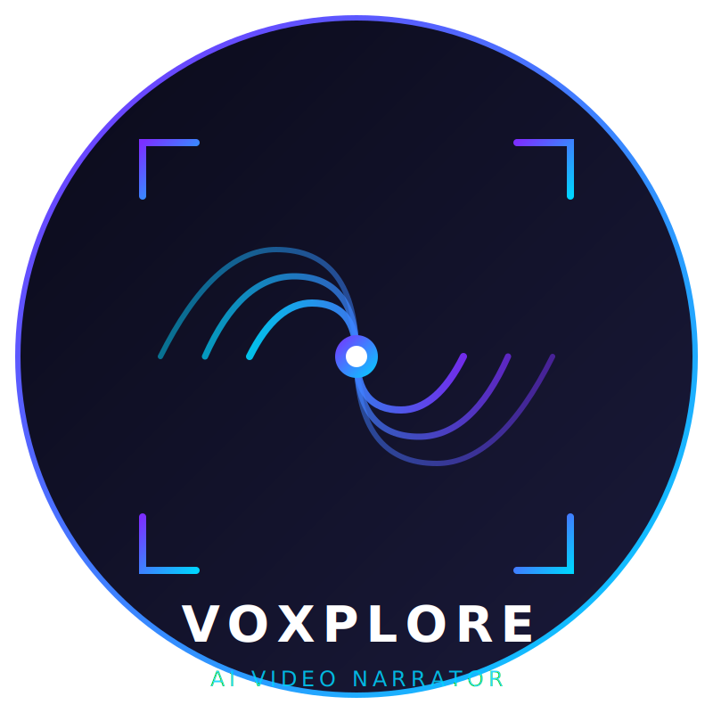

# NARRAFILM

<div align="center">



### AI First-Person Video Narrator

**上传视频，AI 代入画面主角视角，一键生成配音解说**

[](https://github.com/Agions/NARRAFILM/stargazers)
[](LICENSE)
[](https://www.python.org/)
[](https://www.qt.io/)
[](https://github.com/Agions/NARRAFILM)

**免费 · 开源 · 跨平台** 支持 Windows / macOS / Linux

</div>

---

## 🎯 一句话介绍

> **NARRAFILM** 将任何包含明确主角的视频，通过 AI 代入"我"的视角，一键生成电影感配音解说。让 vlog、教学、游戏录屏、会议录制瞬间变成"我在现场"的专业叙事视频。

---

## 工作流程

```
输入视频
    │
    ▼
┌─────────────────────────────────────────────┐
│  1. 场景理解 (Qwen2.5-VL)                   │
│     逐帧分析画面 → 地点、人物行为、物体、氛围   │
└─────────────────────────────────────────────┘
    │
    ▼
┌─────────────────────────────────────────────┐
│  2. 第一人称解说生成 (DeepSeek-V3)            │
│     代入主角视角，用"我"的口吻写解说稿         │
└─────────────────────────────────────────────┘
    │
    ▼
┌─────────────────────────────────────────────┐
│  3. 情感配音合成 (Edge-TTS / F5-TTS)         │
│     电影感旁白，语速/情感可调                  │
└─────────────────────────────────────────────┘
    │
    ▼
┌─────────────────────────────────────────────┐
│  4. 精准字幕 (TTS word-level timing)         │
│     音字同步，电影级字幕样式                  │
└─────────────────────────────────────────────┘
    │
    ▼
┌─────────────────────────────────────────────┐
│  5. 合成输出                                 │
│     MP4 成品 / 剪映草稿导出                   │
└─────────────────────────────────────────────┘
```

---

## ✨ 核心能力

| 能力 | 说明 |
|------|------|
| 🎬 **第一人称代入** | AI 分析画面主角视角，解说"我"看到什么 |
| 🎙️ **情感配音** | 多风格旁白（治愈/悬疑/励志/怀旧/浪漫） |
| ✍️ **精准字幕** | 电影级 ASS 字幕，音字完全同步 |
| 🖥️ **剪映导出** | 原生草稿格式，直达剪映继续精剪 |
| 🌐 **全本地运行** | 依赖可完全自托管，无需上传视频 |

---

## 🚀 快速开始

### 方式一：下载安装包

访问 [Releases](https://github.com/Agions/NARRAFILM/releases) 下载对应平台的安装包。

### 方式二：从源码构建

```bash
git clone https://github.com/Agions/NARRAFILM.git
cd NARRAFILM
pip install -r requirements.txt
python app/main.py
```

### 配置 AI（最低只需一个 Key）

```bash
# DeepSeek（推荐，解说生成主力）
export DEEPSEEK_API_KEY="sk-xxxx"

# 或 OpenAI（GPT-4o 用于场景理解）
export OPENAI_API_KEY="sk-xxxx"

# 通义千问（备选，Qwen2.5-VL 场景理解）
export QWEN_API_KEY="sk-xxxx"
```

> 不配置任何 Key 时，基础功能（音频合成等）仍可正常使用。AI 能力需要至少一个 API Key。

---

## 🤖 技术架构（2025-2026 最新模型）

| 模块 | 模型 | 说明 |
|------|------|------|
| 场景理解 | **Qwen2.5-VL** (72B) | 阿里开源，视频理解 SOTA，支持 Native 视频输入 |
| 解说生成 | **DeepSeek-V3** | 最强开源 LLM，第一人称视角提示词执行最优 |
| 语音识别 | **SenseVoice** | 阿里 FunAudioLLM，中文 ASR + 说话人分离 |
| 配音合成 | **Edge-TTS** + **F5-TTS** | Edge 主流优质低延迟，F5 零样本音色克隆 |
| 云端备选 | GPT-4o / Claude Sonnet | 按需切换 |

---

## 📖 文档

| 文档 | 说明 |
|------|------|
| [快速开始](docs/guide/quick-start.md) | 5 分钟上手 |
| [功能介绍](docs/features.md) | 全部功能详解 |
| [FAQ & 疑难排查](docs/faq.md) | 常见问题 |

---

## 🛠️ 技术栈

| 类别 | 技术 |
|------|------|
| UI 框架 | PySide6 (Qt 6.5+) |
| 编程语言 | Python 3.10+ |
| 视频处理 | FFmpeg + OpenCV |
| 本地 ASR | SenseVoice / Faster-Whisper |
| 云端 AI | OpenAI SDK（多厂商兼容） |
| 字幕格式 | SRT / ASS（电影级样式） |
| 导出格式 | MP4 / 剪映草稿 |

---

## 📄 许可证

[MIT License](LICENSE) · Copyright © 2025-2026 [Agions](https://github.com/Agions)

---

<div align="center">

⭐ 如果这个项目对您有帮助，请给一个 Star

</div>
